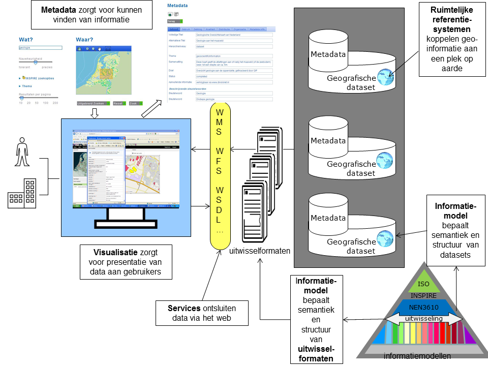

# Raamwerk van geo-standaarden

**versie:** 2.4 - concept

## Hoofdstuk 1 - Inleiding
### 1.1	Doelgroep en doel van dit Raamwerk van geo-standaarden
Het doel van het Raamwerk van geo-standaarden is om uit de grote verscheidenheid aan standaarden de juiste set te kiezen: die standaarden die nodig zijn voor het realiseren van een geo-informatie infrastructuur (GII). Bij de keuzes zijn de volgende uitgangspunten gehanteerd: internationale aansluiting, volwassenheid en openheid van de standaarden en breed gebruik. Met de in het Raamwerk genoemde standaarden is het mogelijk een solide GII te bouwen, die verenigbaar is met de internationale ontwikkelingen en aansluit op de nationale e-overheid.

Het Raamwerk van geo-standaarden is geschreven voor iedereen die betrokken is bij het toepassen van standaarden voor geo-informatie. Zoals informatiemanagers, stuurgroepleden, beleidsmedewerkers, projectleiders, adviseurs, architecten, IT-leveranciers, en voor personen die standaarden en specificaties implementeren in hun organisatie en willen kunnen integreren met andere organisaties in Nederland en Europa.

### 1.2 Status van het Raamwerk van geo-standaarden
Om zo breed mogelijk draagvlak voor dit Raamwerk te creëren wordt het Raamwerk binnen de overheid formeel belegd via het [Geo-Informatie Beraad](http://www.geonovum.nl/onderwerpen/standaardisatie-nationaal-en-internationaal/gi-beraad), de basislijst open standaarden en de Nederlandse Overheid Referentie Architectuur [PDF](http://www.geonovum.nl/sites/default/files/nora3.0.pdf). Daarnaast zijn de in het Raamwerk genoemde standaarden geharmoniseerd met de voor INSPIRE geldende richtlijnen.

Het GI-beraad heeft in juni 2006 het Raamwerk van geo-standaarden vastgesteld als verplichtend voor de GI-beraad deelnemers. De programmaraad stelt elke nieuwe versie van het raamwerk vast.

Een aantal geo-standaarden uit het raamwerk staan op de pas toe of leg uit lijst van het [Forum Standaardisatie](http://www.geonovum.nl/onderwerpen/standaardisatie-nationaal-en-internationaal/forum-standaardisatie). Daarnaast zijn een aantal geo-standaarden gerelateerd aan [INSPIRE](http://www.geonovum.nl/onderwerpen/inspire/algemeen-inspire). Dit zijn de INSPIRE technical guidelines, ISO of OGC standaarden die door INSPIRE zijn voorgeschreven, en Nederlandse profielen die compliant zijn met INSPIRE. Hoewel INSPIRE formeel geen geo-standaarden organisatie is kunnen de invoeringsregels van INSPIRE wel als zodanig gebruikt worden. De INSPIRE regels zijn vaak een nadere invulling van de andere standaarden organisaties en de INSPIRE data specificaties voor de thema’s hebben een  duidelijke relatie met de informatiemodellen in Nederland.

Het Raamwerk van geo-standaarden is het verdiepingsdocument waarnaar NORA  3.0 en het [NORA dossier geo-informatie](http://www.geonovum.nl/onderwerpen/geo-architectuur/geo-nora)  verwijzen voor de te hanteren geo-standaarden. 
### 1.3 Leeswijzer
Het Raamwerk van geo-standaarden is vergeleken met de vorige versies teruggebracht tot een sterk afgeslankte vorm waarin de samenhang van de geo-standaarden centraal staat. De actuele, aan wijziging onderhevige informatie is, voor zover dat nog niet zo was, verhuisd naar de website van Geonovum. Hoofdstuk 1 biedt  achtergrondinformatie over het document, hoofdstuk 2 beschrijft de geo-standaarden in samenhang. Dit is het hoofddoel van het document. Voor alle verdieping en actuele zaken, zoals lijsten van geldende standaarden, bevat hoofdstuk 2 verwijzingen naar de website.

## Hoofdstuk 2 - Geo-standaarden in samenhang
**Het doel van het Raamwerk van geo-standaarden is om uit de grote verscheidenheid aan standaarden die er zijn voor geo-informatie, de juiste set te kiezen. In combinatie kunnen deze geo-standaarden worden gebruikt om een Geo-Informatie Infrastructuur (GII) te realiseren. In een dergelijke infrastructuur spelen ze ieder een eigen rol. Dit hoofdstuk beschrijft en introduceert de geo-standaarden in samenhang, en verwijst voor verdieping van elk onderwerp naar de website van Geonovum.** 

### 2.1 Wat is geo-informatie?
Geo-standaarden zijn er om met geo-informatie te kunnen werken. Denk hierbij bijvoorbeeld aan het opslaan, uitwisselen, en presenteren van geo-informatie. Maar wat is eigenlijk geo-informatie? Geo-informatie omvat alle plaatsgebonden kenmerken van informatieobjecten. Alle informatie waarin een ruimtelijke component is opgenomen kan worden beschouwd als geo-informatie. Met een ruimtelijke component of kenmerk wordt een verwijzing naar een plek op de aarde bedoeld. Dit kan een fysiek object zijn, zoals een gebouw of kanaal, een administratieve eenheid, zoals een gemeente of postcode gebied of een abstract gegeven als ‘woonomgevingbeleving’. Een locatie kan statisch of dynamisch zijn; denk bij dit laatste bijvoorbeeld aan vluchtige informatie die slechts op een bepaald moment relevant is, of aan bewegende objecten. 

De laatste jaren heeft het gebruik van geo-informatie in alledaagse webtoepassingen een hoge vlucht genomen door de komst van bijvoorbeeld Bing Maps, Google Earth, Google Maps, en OpenStreetMap.

De kracht van geo-informatie zit in het gemak waarmee op basis van locatie verschillende typen van informatie aan elkaar gerelateerd en met elkaar vergeleken kunnen worden. Dit helpt mensen enorm bij het verkrijgen van inzicht op basis van informatie en zorgt ervoor dat veel effectiever beslissingen kunnen worden genomen. 

*Figuur 1 - Thema relaties op basis van lokatie*

Ruimtelijke vragen worden constant gesteld. In de vorm van *‘Waar?’* en door van een plek of locatie informatie op te vragen:
* Waar is ruimte om een nieuwe school te plaatsen in een wijk? En staat die niet nabij coffeeshops en cafés? 
* Wat zijn de openbare voorzieningen in de nabijheid van dit koop- of huurhuis? En is sprake van bodemverontreiniging in de tuin?
* Waar kan ik het meest nabij mijn afval wegbrengen?
* Welk gebied wordt met overstroming bedreigd?
* Waar staan de files?
* Waar is de woonomgevingbeleving het laagst?

Sommige van deze ‘Waar?’ en ‘Wat is daar?’ vragen kunnen eenvoudig worden beantwoord, veel anderen zijn complexer te beantwoorden en vragen de combinatie van verschillende geo-informatiebronnen van 
verschillende organisaties. 

Bijvoorbeeld de *‘Waar?’* vraag van de school vereist tenminste:
* De locaties van de coffeeshops en cafés;
* De woonadressen van de huidige leerlingen;
* De mogelijkheden binnen het bestemmingsplan;
* Reistijd en afstand naar school.

### 2.2	Naar een Geo-Informatie Infrastructuur (GII)
Voor het oplossen van de ruimtelijke vraagstukken uit de vorige paragraaf is toegang tot de betreffende geo-informatie een vereiste. Om deze geo-informatie zo laagdrempelig mogelijk te ontsluiten is in Nederland de afgelopen jaren gewerkt aan een geo-informatie infrastruuctuur (GII). Voor het verwezenlijken van een GII zijn standaarden onontbeerlijk: Zij zorgen ervoor dat het wiel niet voor een tweede keer wordt uitgevonden en dat er bij uitwisseling overeenstemming is tussen beide partijen over het formaat en de betekenis van de uitgewisselde gegevens. Belangrijk daarbij is dat het open standaarden betreft. Een open standaard is voor iedereen  toegankelijk en toekomstvast omdat toegang tot de standaard en beheer van de standaard bij een non-profit organisatie zijn belegd.  De in dit Raamwerk van geo-standaarden benoemde standaarden zijn volledig open.

### 2.3 Geo-standaarden: het overzicht
Voor het beantwoorden van ruimtelijke vragen zoals de voorbeelden in de vorige paragraaf, is het meestal nodig om informatiebronnen van verschillende organisaties met elkaar te combineren. Dit is niet mogelijk zonder standaarden. De afgelopen twintig jaar is internationaal en nationaal gewerkt aan een set van standaarden die het mogelijk maakt om de kracht van geo-informatie ten volle te benutten. 

*Figuur 2 - Geo-standaarden in samenhang*

Een GII is ervoor bedoeld om geo-informatie beschikbaar te stellen en toegankelijk te maken voor gebruik. Hiervoor zijn verschillende dingen nodig, zoals Figuur 2 laat zien:
* Het beschrijven van informatiebronnen met **metadata**, zodat de informatiebronnen **vindbaar** worden. 
* Het inrichten van **web services**, zodat geo-informatie via het web kan worden **geraadpleegd**. 
* Het definiëren van **visualisatieregels**, zodat geo-informatie op een eenduidige manier wordt **gepresenteerd** aan gebruikers. 
* Het beschrijven van de inhoud van informatiebronnen middels een **informatiemodel**, zodat de **semantiek** en **structuur** bekend zijn. 
* Het definiëren van **uitwisselformaten**, zodat duidelijk is in wat voor **vorm** de geo-informatie wordt uitgewisseld. 
* Het koppelen van geo-informatie aan een plek op het aardoppervlak met behulp van een **ruimtelijk referentiesysteem**.

Voor al deze componenten van een GII zijn standaarden beschikbaar. 

#### Metadata
Allereerst moet de informatie, die via de GII wordt verspreid, beschreven worden. Dit gebeurt op twee niveaus: het niveau van de dataset en het niveau van de individuele informatie-objecten. Karakteristieken van datasets, zoals de eigenaar en de actualiteit, worden beschreven met behulp van **metadata**. Metadata wijst de weg in onze informatiehuishouding, voorkomt dubbele inwinning en beheer van data en zorgt ervoor dat geo-informatie snel kan worden gevonden.

Voor meer informatie over metadata en de actuele standaarden, zie:
http://www.geonovum.nl/onderwerpen/metadata

### Services
Om de geo-informatie te kunnen vinden, raadplegen, en downloaden, zijn er **web services** ingericht in een GII. Er zijn verschillende soorten services: bijvoorbeeld de discovery service voor het vinden van geo-informatie op basis van metadata; de view service voor het bekijken van geo-informatie op het web, en de download service om geo-informatie te verkrijgen.  

Voor meer informatie over services en de actuele standaarden, zie:
http://www.geonovum.nl/onderwerpen/services

#### Visualisatie
Om de geo-informatie visueel te presenteren op een kaart worden er **visualisatieregels** opgesteld. Denk hierbij bijvoorbeeld aan vlakvullingen, lijnstijlen, symbologie, etc. Veel inhoudelijke domeinen hebben een een standaard visualisatie gedefinieerd voor hun informatiemodel. Deze visualisatieregels moeten worden vastgelegd en kunnen dan bijvoorbeeld worden toegepast in een view service. 

Voor meer informatie over visualisatie en de actuele standaarden, zie:
http://www.geonovum.nl/onderwerpen/visualisatie

#### Informatiemodellen
De individuele informatie-objecten in een dataset worden beschreven met behulp van een **informatiemodel**. Dit ziet u rechtsonder in de figuur. De semantiek (betekenis) en de structuur van de informatie moet bekend zijn zodat gebruikers de informatie optimaal kunnen benutten. Een informatiemodel, ook wel dataspecificatie genoemd, zet schematisch de afspraken over begrippen en definities van gegevens binnen een bepaald domein op een rij. Dit vereenvoudigt de uitwisseling van informatie.

Voor meer informatie over informatiemodellen en de actuele standaarden, zie:
http://www.geonovum.nl/onderwerpen/informatiemodellen

#### Uitwisselformaten
Op basis van deze informatiemodellen worden **uitwisselformaten**  gedefinieerd. Waar een informatiemodel de semantiek bepaalt, beschrijft een uitwisselformaat de vorm of syntax waarin geo-informatie op basis van een bepaald informatiemodel wordt uitgewisseld. Er zijn verschillende manieren om geo-informatie te representeren en uit te wisselen. Een algemene onderverdeling is te maken in vectordata, rasterdata en sensordata. Voor deze drie representatievormen zijn er verschillende standaard uitwisselformaten beschikbaar.

Voor meer informatie over uitwisselformaten en de actuele standaarden, zie:
http://www.geonovum.nl/onderwerpen/uitwisselformaten

### Ruimtelijke referentiesystemen
Geo-informatie is direct gekoppeld aan locaties op aarde. De wijze waarop dat gebeurt wordt beschreven in het ruimtelijk-referentie systeem. Er zijn meerdere methoden om de locatie van objecten vast te leggen. De meest bekende methode is coördinaat  referentie waarbij coördinaten van een locatie worden vastgelegd. Een alternatieve methode is het  lineair referentie systeem. Maar ook kan de locatie van een object indirect beschreven zijn. Er zijn meerdere standaard referentiesystemen beschikbaar. 

Voor meer informatie over ruimtelijke referentiesystemen en de actuele standaarden, zie: http://www.geonovum.nl/onderwerpen/coördinaatsystemen/algemeen-coördinaatsystemen

### WORK IN PROGRESS - Overige verwijzingen naar de website die nodig zijn nog in dit stuk verwerken.

Op de website van Geonovum staat de lijst van actuele, te hanteren geo-standaarden. Zie: 

[Te hanteren geo-standaarden](http://www.geonovum.nl/onderwerpen/geo-standaarden) (TODO de pagina moet nog worden aangemaakt)

[Verdiepingsdocument Ruimtelijke referentie-systemen](http://www.geonovum.nl/onderwerpen/coördinaatsystemen/algemeen-coördinaatsystemen) (TODO het document Ruimtelijke Referentiesystemen moet nog op de website worden geplaatst, daarna moet deze link naar dat document verwijzen)

[Verdiepingsdocument Metadata](http://www.geonovum.nl/onderwerpen/metadata/algemeen-metadata) (TODO het document over metadata moet nog op de website worden geplaatst, daarna moet deze link naar dat document verwijzen)

[Verdiepingsdocument Informatiemodellen](http://www.geonovum.nl/onderwerpen/informatiemodellen/algemeen-informatiemodellen) (TODO het document over metadata moet nog op de website worden geplaatst, daarna moet deze link naar dat document verwijzen)

